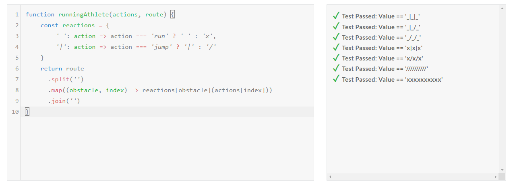

# V_Camp Desafio Edabit

- Nome Completo
Giancarlo Wisinewski Gomes

- Linkedin
https://www.linkedin.com/in/giangomes/

- Captura de tela dos testes passando na plataforma

- Link do desafio realizado
https://edabit.com/challenge/pMrpGchpAwpM5BySZ

- Comentários
Desafio ótimo para demonstrar como o uso de object literal e operadores ternários podem substituir "IF's e ELSE's" aninhandos, e também para aplicar métodos de manipulação de arrays e strings a fim de tornar o código mais legível.